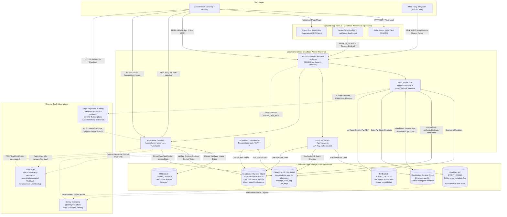
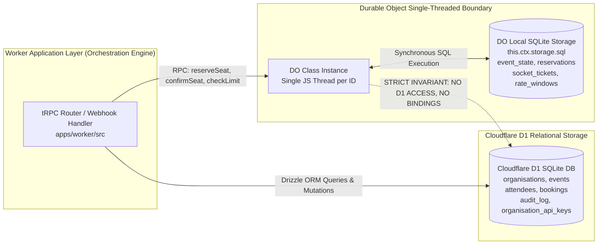

# System Architecture Diagram & Technical Boundary Reference

Audience: Core engineers, infrastructure architects, and integration engineers. This document provides a technical map of the event booking platform's runtime topology, component interactions, execution sequences, and strict storage invariants as implemented in the codebase.

---

## 1. High-Level System Topology

The platform is structured as a Turborepo monorepo with strict application and runtime boundaries:
- **`apps/web-app`**: Next.js (Pages Router) compiled via `@opennextjs/cloudflare` and deployed to Cloudflare Workers (using the OpenNext assets binding).
- **`apps/worker`**: Core Cloudflare Worker hosting the tRPC API router, raw HTTP handlers (webhooks, file uploads, WebSockets), public REST API (`/api/v1/events`), and the 5-minute reconciliation cron trigger.
- **Edge Storage Layer**: Cloudflare D1 (relational data), Cloudflare Durable Objects (`SeatLedger` for per-event seat state, `RateLimiter` for rate limiting), Cloudflare R2 (media & ticket PDF storage), and Cloudflare KV (read-through metadata cache).
- **External Services**: Clerk (identity & JWT verification), Stripe (payments, subscriptions, refunds), and Sentry (error & invariant monitoring).

### Topology Diagram

### Key Structural Boundary Invariants

1. **Zero Database / Durable Object Access from Web Application:**
   As confirmed in `apps/web-app/wrangler.jsonc`, the Next.js application holds only two bindings: `ASSETS` and `WORKER_SERVICE`. It possesses zero database credentials, zero Drizzle schema imports, and no bindings to D1, Durable Objects, KV, or R2. All database and state queries are mediated exclusively through the worker's tRPC procedures and raw handlers.
2. **SSR Service Binding Hop:**
   Server-Side Rendering calls within `getServerSideProps` do not perform public HTTP fetches across Cloudflare's edge (which triggers Cloudflare error 1042 worker-to-worker loop blocking). Instead, they dispatch directly into the worker via Cloudflare's private `WORKER_SERVICE` binding using `getCloudflareContext().env.WORKER_SERVICE.fetch()`.
3. **Networkless JWT Verification:**
   Incoming authenticated requests to tRPC procedures and uploads verify the Clerk JWT against a static public key secret (`CLERK_JWT_KEY`) directly within edge memory without issuing per-request HTTP calls to Clerk's JWKS endpoints.

---

## 2. Sequence Diagram: Seat-Hold to Confirmed Booking Flow

The diagram below details the complete lifecycle of a seat purchase: reserving a hold, initiating checkout, user payment, webhook confirmation, atomic seat consumption in the Durable Object, durable D1 booking creation, and PDF ticket generation.

```mermaid
sequenceDiagram
    autonumber
    actor User as Attendee (Browser)
    participant Worker as Worker (tRPC & Webhooks)
    participant RateLimiter as RateLimiter DO
    participant SeatLedger as SeatLedger DO
    participant Stripe as Stripe API & Checkout
    participant D1 as Cloudflare D1
    participant R2 as Cloudflare R2 (EVENT_TICKETS)
    participant Sentry as Sentry Alerting

    %% Step 1: Reserve Seat
    Note over User,SeatLedger: Phase 1: Seat Reservation & Concurrency Lock
    User->>Worker: tRPC reserveSeat({ eventId, seatCount })
    Worker->>RateLimiter: checkLimit('reserveSeat', 10, 60s)
    RateLimiter-->>Worker: allowed: true
    Worker->>SeatLedger: reserveSeat(userId, seatCount)
    activate SeatLedger
    Note over SeatLedger: Synchronous Critical Section:<br/>1. Verify available_seats >= seatCount<br/>2. Guard pending holds per user<br/>3. Insert reservations row (status='pending')<br/>4. Schedule setAlarm(expiresAt = now + 15m)
    SeatLedger-->>Worker: { reservationId: holdId, expiresAt }
    deactivate SeatLedger
    Worker-->>User: { holdId, expiresAt }

    %% Step 2: Create Checkout Session
    Note over User,Stripe: Phase 2: Checkout Session Creation
    User->>Worker: tRPC createCheckoutSession({ holdId, eventId })
    Worker->>RateLimiter: checkLimit('createCheckoutSession', 10, 60s)
    RateLimiter-->>Worker: allowed: true
    Worker->>SeatLedger: getHold(holdId)
    SeatLedger-->>Worker: { userId, seatCount, status: 'pending', expiresAt }
    Note over Worker: Validate: exists -> belongs to caller -><br/>status is pending -> not expired
    Worker->>D1: SELECT pricePerSeat FROM events WHERE id = eventId
    D1-->>Worker: { pricePerSeat }
    Note over Worker: Compute idempotencyKey = `checkout_${holdId}`
    Worker->>Stripe: checkout.sessions.create(line_items[qty=hold.seatCount], metadata={holdId, eventId, userId})
    Stripe-->>Worker: { url: checkoutSessionUrl }
    Worker-->>User: { sessionUrl }

    %% Step 3: Payment
    Note over User,Stripe: Phase 3: External Payment
    User->>Stripe: Complete Card Payment on Hosted Checkout Page
    Stripe-->>User: Redirect to success_url

    %% Step 4: Webhook Handling & Confirmation
    Note over Stripe,R2: Phase 4: Webhook-Driven Confirmation
    Stripe->>Worker: POST /webhook/stripe (payment_intent.succeeded)
    Note over Worker: 1. Verify HMAC-SHA256 signature<br/>2. Parse metadata { holdId, eventId }
    Worker->>Worker: confirmBookingFromPayment(db, seatLedger, holdId, ...)
    
    Worker->>D1: SELECT pricePerSeat FROM events WHERE id = eventId
    D1-->>Worker: { pricePerSeat }

    Worker->>SeatLedger: confirmSeat(holdId)
    activate SeatLedger
    alt Hold is Valid & Pending
        Note over SeatLedger: Atomic transition:<br/>status = 'confirmed'<br/>(remains in used_seats)
        SeatLedger-->>Worker: { userId, seatCount }
    else Hold Expired (HOLD_EXPIRED)
        SeatLedger-->>Worker: Error('HOLD_EXPIRED')
        Worker->>SeatLedger: releaseSeat(holdId)
        Worker->>D1: INSERT INTO audit_log (eventType: 'hold_released_explicit')
        Worker-->>Stripe: 200 OK (hold_expired handled)
        Note over Worker: [Failure Branch 1: hold_expired]<br/>Payment arrived after 15m hold expired.<br/>See ROADMAP.md & SECURITY.md.
    else Hold Already Used (HOLD_ALREADY_USED)
        SeatLedger-->>Worker: Error('HOLD_ALREADY_USED')
        Worker->>D1: SELECT stripePaymentIntentId FROM bookings WHERE holdId = holdId
        alt Booking Missing in D1
            D1-->>Worker: null
            Worker-->>Stripe: 500 Internal Server Error
            Note over Worker: [Failure Branch 2: orphaned_hold]<br/>DO confirmed seat but D1 insert crashed previously.<br/>Surfaced for 5-min reconciliation. See ROADMAP.md.
        else Matching PaymentIntent ID (Stripe Retry)
            D1-->>Worker: { stripePaymentIntentId: sameId }
            Worker-->>Stripe: 200 OK (already_confirmed)
        else Conflicting PaymentIntent ID (Double-Charge)
            D1-->>Worker: { stripePaymentIntentId: differentId }
            Worker->>Sentry: captureMessage('DUPLICATE PAYMENT CAPTURED', error)
            Worker->>D1: INSERT INTO audit_log (eventType: 'duplicate_payment_captured')
            Worker-->>Stripe: 200 OK
            Note over Worker: [Failure Branch 3: duplicate_payment_for_confirmed_hold]<br/>Second payment for same hold. Sentry alerted +<br/>audit logged for manual refund. See SECURITY.md.
        end
    end
    deactivate SeatLedger

    Note over Worker: Defence-in-depth: verify expectedPence == amountReceivedPence
    Worker->>D1: SELECT * FROM attendees WHERE userId = confirmResult.userId
    D1-->>Worker: attendeeRow

    Worker->>D1: INSERT INTO bookings (id, eventId, attendeeId, status='confirmed', holdId, stripePaymentIntentId)
    D1-->>Worker: bookingRow

    Worker->>D1: INSERT INTO audit_log (eventType: 'booking_confirmed')
    Note over Worker: Async Stubs: dispatchEmailConfirmation() & dispatchCalendarInvite()

    Note over Worker: Lazy / Webhook Ticket PDF Generation
    Worker->>Worker: generateTicketPdf({ attendeeName, eventName, eventDate, seatCount, bookingId })
    Worker->>R2: PUT tickets/{bookingId}.pdf (application/pdf)
    Worker-->>Stripe: 200 OK

    %% Step 5: Attendee Retrieval
    Note over User,R2: Phase 5: Ticket Fetching
    User->>Worker: tRPC getTicket({ bookingId })
    Worker->>RateLimiter: checkLimit('getTicket', 30, 60s)
    RateLimiter-->>Worker: allowed: true
    Worker->>D1: SELECT booking + event + attendee WHERE id = bookingId
    Worker->>Worker: Authorize (ctx.userId == attendee.userId)
    Worker->>R2: GET tickets/{bookingId}.pdf
    alt R2 Cache Hit
        R2-->>Worker: PDF Bytes
    else R2 Cache Miss (Webhook Generation Failed / Pre-existing)
        Worker->>Worker: generateTicketPdf(...) [lazy generation]
        Worker->>R2: PUT tickets/{bookingId}.pdf
    end
    Worker-->>User: { pdf: base64, filename }
```

### Summary of Edge Failure Branches

| Failure Outcome | Condition & Code Behavior | Technical Documentation Reference |
|---|---|---|
| **`hold_expired`** | Payment completed after the 15-minute DO hold window expired. DO releases the expired hold; audit log recorded with `hold_released_explicit`; returns 200 to Stripe. | See `ROADMAP.md` and `SECURITY.md` for expiration grace details. |
| **`orphaned_hold`** | The DO successfully confirmed the seat (`HOLD_ALREADY_USED`), but D1 has no corresponding `bookings` row (e.g. worker crash between DO and D1 writes). Webhook returns HTTP 500 to keep Stripe retrying, and the 5-minute reconciliation cron surfaces the orphan to Sentry. | See `TECHNICAL.md` §2a and §16 for reconciliation design. |
| **`duplicate_payment_for_confirmed_hold`** | A second, distinct PaymentIntent was captured for an already-confirmed hold (double-charge scenario). Handled without clobbering D1: alerts Sentry at `error` severity, logs `duplicate_payment_captured` to `audit_log`, and returns 200 to Stripe for manual support refund. | See `SECURITY.md` and `TECHNICAL.md` §2e for double-charge prevention. |

---

## 3. Storage Invariants & The DO / D1 Boundary Rule

This codebase strictly separates mutable edge coordination from durable relational storage through a fundamental architectural boundary rule:

> **THE DO / D1 STORAGE BOUNDARY RULE:**
> 1. **Durable Objects hold only live, transient, or rate-limiting state** (`reservations`, `event_state`, `socket_tickets`, `rate_windows`) within their private, single-threaded SQLite storage (`this.ctx.storage.sql`).
> 2. **D1 is the single durable system of record** for persistent application state: organisations, events, attendees, confirmed bookings, audit logs, and API keys.
> 3. **Nothing reads or writes D1 from inside a Durable Object.** Durable Objects are completely unaware of D1 bindings, execute zero SQL against D1, and never participate in distributed two-phase commits. All synchronization between DO and D1 is orchestrated externally by worker procedures, webhook handlers, or scheduled cron routines.

### Boundary Architecture Model

### Why This Boundary Rule Is Enforced

- **Preservation of the Concurrency Critical Section:**
  The `reserveSeat` method in `SeatLedger` relies on synchronous execution against `this.ctx.storage.sql`. Awaiting an external network round-trip to D1 inside that critical section would yield execution, permitting concurrent `reserveSeat` calls to interleave and invalidating the overselling prevention guarantee.
- **Fault Domain Isolation:**
  D1 network interruptions, schema migrations, or transient timeouts cannot corrupt or deadlock the internal SQLite state of a Durable Object. If a D1 write fails after a DO hold confirmation, the seat remains consumed in the DO and is safely detected by the out-of-band reconciliation cron rather than leaving DO state corrupted.
- **Clean Observability Split:**
  D1 `audit_log` records business events (`booking_confirmed`, `booking_refunded`, `reconciliation_orphan_detected`) originating in the worker layer where D1 bindings are available. DO-internal lifecycle events (e.g. alarm-driven hold release) emit structured logs via Workers Logpush to Axiom, preventing unrecoverable I/O failures inside alarm callbacks.

---

## 4. Implementation vs. Documentation Fidelity Notes

During cross-verification between `TECHNICAL.md` and the active codebase, the following operational nuances were confirmed and reflected in this diagram:
1. **Frontend Deployment Mechanism:**
   `TECHNICAL.md` §1 accurately notes that `apps/web-app` is built using OpenNext for Cloudflare and deployed to Cloudflare Workers (via OpenNext worker assets binding), rather than legacy Cloudflare Pages git integration. The diagram accurately models this container.
2. **Complete Rate Limiting Coverage:**
   The codebase implements rate limiting across both authenticated endpoints (`reserveSeat`, `createCheckoutSession`, `createSocketTicket`, `uploadEventCover`, `getTicket`, `createSubscriptionCheckout`) and public endpoints (`publicRead`, `publicImageRead`, `publicApiPreAuth`, `publicApi`), all powered by the single-threaded `RateLimiter` Durable Object.
3. **Private Ticket Storage:**
   The `EVENT_TICKETS` R2 bucket is fully private. Unlike `EVENT_COVERS` (which serves public HTTP assets at `/images/*`), `EVENT_TICKETS` is accessed strictly via the authenticated `getTicket` tRPC query with ownership and organiser role validation.
